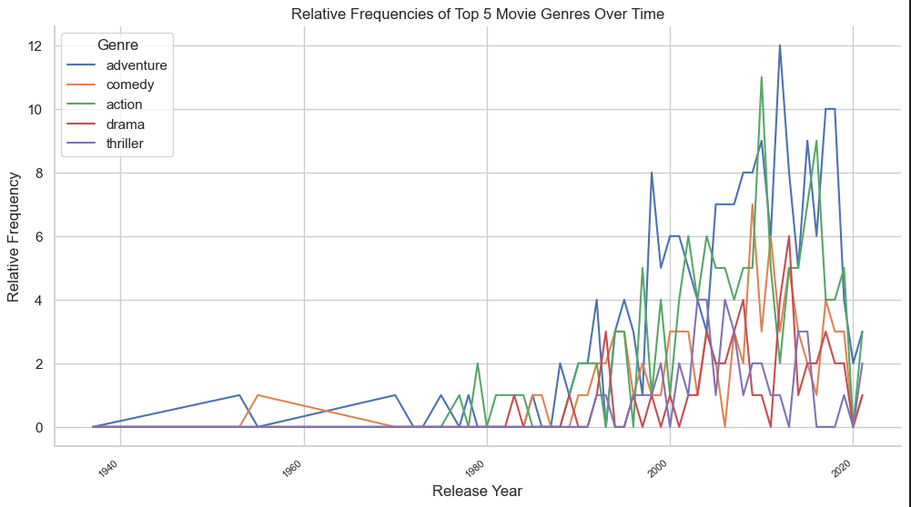
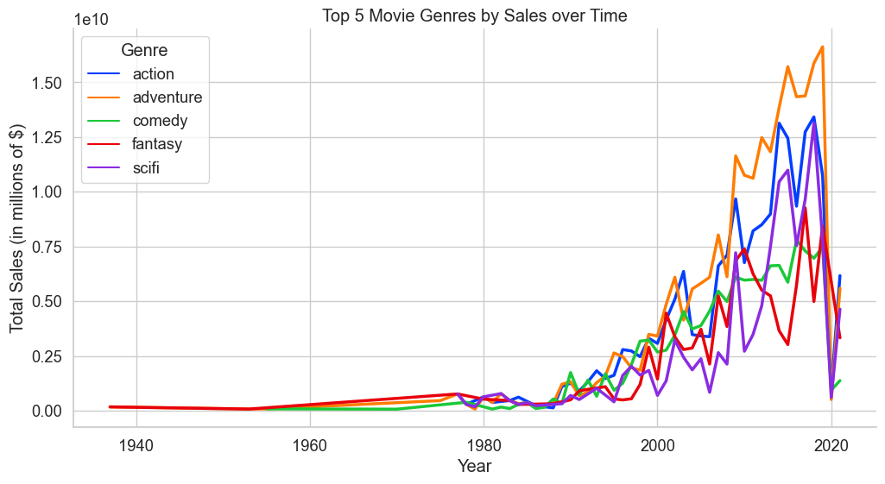

# Introduction 
Our group decided to focus our research questions on movies. We chose this topic because every member in the group was an avid movie watcher and enjoyed investigating the intricacies behind what made movies popular. We all approached this from different angles, one member correlated length with popularity, another measured the money generated by specific genres and how frequently they were used in movies, another also measured the correlation between the quality and popularity of movies. Through asking these questions we all arrived at our unique solutions to the questions we posed at the start of the project.

# Exploratory Data Analysis

## Question 1: **How have the relative frequencies of different movie genres changed over time? Are there certain genres that have become more or less popular over the past few decades?**
Popularity is an amorphous term that can have multiple different metrics through which it can be measured. I decided to measure the popularity of genres through how much money they earned and how frequently they appeared in movies. The dataset we chose has a column that lists the genres of every movie in the set, through counting how many times a specific genre was repeated throughtout the dataset and then correlating it with the year I was able to find out the relative frequency of the genre, or how often a movie was released in a year that included the genre. I used this relative frequency as one measure of popularity to find the most popular genre.

There were 21 genres in total that was available in our dataset, I narrowed that down to the top 5 most popular genres so the graph was not overplotted and remained legible. However viewing the relative frequency of the other less popular genres is also possible. The second method I used to measure popularity was the money they brought in through sales. Movies have multiple genres associated with them, so I saw what movies were associated with each genre and added up the global sales of said movie. Through this I was able to see how much money was brought in by each genre.

I had the same thought process for this method and decided to graph the top 5 most popular genres. From this graph I found out that adventure again was the genre that was financially the most successfull. However action was a close second. Surprisingly, in the previous year the genre scifi seems to have caught up with action and is basically at the same popularity financially. An obvious correlation to make would be that the genres that make the most money seem to have the most movies made with the respective genre. Using these two methods of gauging popularity I found out that the relative frequencies of move genres has increased as a whole, this is due to the fact that the movie industry has grown since its inception. This goes hand in hand with answering the second part of my question, all genres have increased in popularity since the first time they appeared in a movie according to our dataset.

## Question 2

## Question 3 