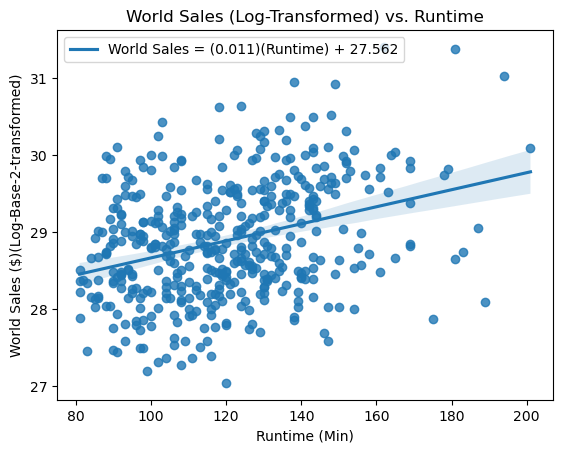
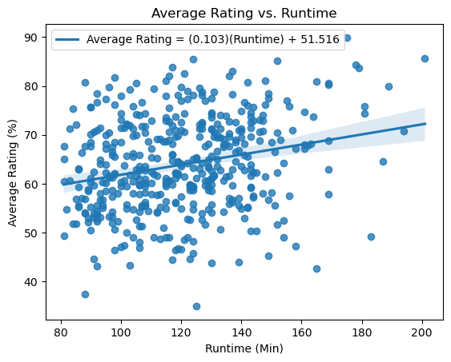

# Introduction 
Our group decided to focus our research questions on movies. We chose this topic because every member in the group was an avid movie watcher and enjoyed investigating the intricacies behind what made movies popular. We all approached this from different angles, one member correlated length with popularity, another measured the money generated by specific genres and how frequently they were used in movies, another also measured the correlation between the quality and popularity of movies. Through asking these questions we all arrived at our unique solutions to the questions we posed at the start of the project.

# Exploratory Data Analysis

# Results and Discussion

## Question 1: **How have the relative frequencies of different movie genres changed over time? Are there certain genres that have become more or less popular over the past few decades?**

 

Popularity is an amorphous term that can have multiple different metrics through which it can be measured. I decided to measure the popularity of genres through how much money they earned and how frequently they appeared in movies. The dataset we chose has a column that lists the genres of every movie in the set, through counting how many times a specific genre was repeated throughtout the dataset and then correlating it with the year I was able to find out the relative frequency of the genre, or how often a movie was released in a year that included the genre. I used this relative frequency as one measure of popularity to find the most popular genre. [You can find the full analysis notebook here, including the code and the data here.](analysis/analysis1.ipynb)

 

 

There were 21 genres in total that was available in our dataset, I narrowed that down to the top 5 most popular genres so the graph was not overplotted and remained legible. However viewing the relative frequency of the other less popular genres is also possible. The second method I used to measure popularity was the money they brought in through sales. Movies have multiple genres associated with them, so I saw what movies were associated with each genre and added up the global sales of said movie. Through this I was able to see how much money was brought in by each genre.

 

 

I had the same thought process for this method and decided to graph the top 5 most popular genres. From this graph I found out that adventure again was the genre that was financially the most successfull. However action was a close second. Surprisingly, in the previous year the genre scifi seems to have caught up with action and is basically at the same popularity financially. An obvious correlation to make would be that the genres that make the most money seem to have the most movies made with the respective genre. Using these two methods of gauging popularity I found out that the relative frequencies of move genres has increased as a whole, this is due to the fact that the movie industry has grown since its inception. This goes hand in hand with answering the second part of my question, all genres have increased in popularity since the first time they appeared in a movie according to our dataset.

 

## Question 2: **Does the length of a film affect its popularity, as assessed by sales and ratings?**

 

The second question our project addressed was: "Does the length of a film affect its popularity, as assessed by sales and ratings?" In order to answer this question, our main dataset - which provided domestic, international, and worldwide sales for each film - was supplemented by our own dataset containing ratings for each film. This dataset was filled manually and pulled ratings from three sites - IMDb, Letterboxd, and Rate Your Music. Based on the size of the later dataset, 450 films were used for this analysis. The ratings from these sites were standardized to percentages and averaged to calculate the average rating for each film. The worldwide popularity of each film was then calculated based on worldwide sales and average rating, as the following equation describes: (0.5)(world sales/maximum world sales) + (0.5)(average rating).

Linear regressions were performed on the following pairs of variables: domestic sales vs. runtime, international sales vs. runtime, world sales vs. runtime, average rating vs. runtime, and worldwide popularity vs. runtime. To ensure the data fulfilled the assumptions for linear regression, residual plots were graphed for each variable pairing. Where heteroscedasticity was observed, the independent variable was log2-transformed. This log-transformation successfully solved all cases of heteroscedasticity. There were some cases where further data manipulation was required, such as removal of major outliers.

 

 

<b>Fig 1. Worldwide sales (in U.S. dollars) are plotted against runtime (in minutes). </b>  Worldwide sales were log2-transformed due to heteroscedasticity. The equation for the trendline is as follows: log2(World Sales) = (0.01106)(Runtime) + 27.5667. P-value was 7.9933e-13. R2 value was 0.3291. Standard error was 0.0015. Based on a P-value of < 0.0001, the positive correlation is significant at p <= 0.05.

 

 

<b>Fig 2. Average rating (in percentage) is plotted against runtime (in minutes). </b> Ratings from three sites - IMDb, Letterboxd, and Rate Your Music - were standardized and averaged. The equation for the trendline is as follows: Average Rating = (0.1031)(Runtime) + 51.5159. P-value was 1.4572e-07. R2 value was 0.2448. Standard error was 0.0193. Based on a P-value of < 0.0001, the positive correlation is significant at p <= 0.05.

 

 

<b>Fig 3. Popularity (in percentage) is plotted against runtime (in minutes). </b> Popularity score takes into acount both worldwide sales and average rating [calculated as: 0.5 (worldwide sales/maximum worldwide sales) + 0.5 (average rating)]. The equation for the trendline is as follows: Worldwide Popularity = (0.1456)(Runtime) + 24.575. P-value was 1.3668e-18. R2 value was 0.3986. Standard error was 0.0158. Based on a P-value of < 0.0001, the positive correlation is significant at p <= 0.05.

 

Linear regression found significant positive correlations between all variable pairings (Fig. 1, Fig. 2, Fig. 3; figures for domestic sales vs. runtime and international sales vs. runtime are not shown here). In all cases, p-values were less than 0.0001, implying signicance at p <= 0.05. Therfore, the analysis found that film runtime does have an effect on popularity, as well as sales and ratings individually. Specifically, longer movies are more popular and perform better in sales and ratings. The regression line for worldwide popularity vs. runtime suggests that a movie's popularity score increases by around 0.15 for every minute its runtime is increased. There are several hypotheses for why this may be the case. One possibility is that longer runtimes are associated with bigger budget or higher production value projects. Another may be that longer runtimes allow for better story and character development.

Two confounding variables considered were genre and distributor. Longer runtime may be correlated with certain genres or distributors, which in turn were more popular. Although box plots were produced for a base level assessment, the scope of this analysis did not allow for in-depth statistical analysis to test for confounding correlations between runtime and genre or distributor. Therefore, this analysis was unable to determine with certainty whether the positive correlations observed between popularity and runtime were the result of confounding variables.

[You can find the full analysis notebook here, including the code and the data here.](analysis/analysis2.ipynb)

 

## Question 3: **question here**

 

#
# Conclusion
